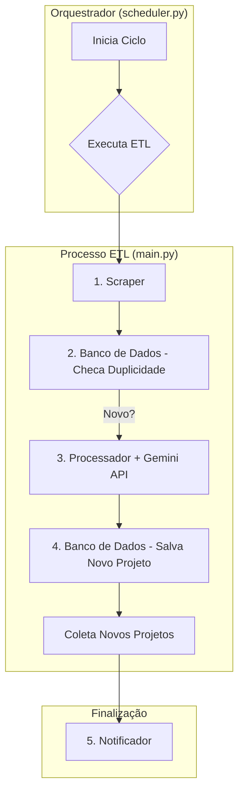

# System Patterns: ETL de Oportunidades Freelancer

## 1. Arquitetura de Componentes

O sistema será modular, com cada componente tendo uma responsabilidade única. Isso facilita o desenvolvimento, o teste e a manutenção.



- **`scheduler.py`**: O ponto de entrada. Sua única função é rodar o script principal (`main.py`) no intervalo de tempo definido (a cada 6 horas).
- **`main.py`**: O orquestrador do fluxo ETL. Ele coordena as chamadas para os outros módulos.
- **`scraper.py`**: Responsável por acessar o Workana, extrair os dados brutos dos projetos e retorná-los em uma estrutura padronizada (lista de dicionários).
- **`database.py`**: Módulo que abstrai toda a comunicação com o banco de dados SQLite. Terá funções como `add_project()` e `project_exists()`.
- **`processor.py`**: Recebe os dados brutos de um projeto, comunica-se com a API do Gemini para obter as tags de categorização e retorna o dado enriquecido.
- **`notifier.py`**: Recebe uma lista de projetos novos e já processados, formata o conteúdo do email e o envia.

## 2. Fluxo de Dados (Data Flow)

1. O **Scheduler** ativa o `main.py`.
2. O `main.py` chama o **Scraper** para obter a lista de projetos da página principal.
3. Para cada projeto extraído, o `main.py` usa o **Database** para verificar (pela URL do projeto) se ele já foi processado anteriormente.
4. Se o projeto for novo:
    a. O `main.py` envia os dados para o **Processor**.
    b. O **Processor** chama a **API do Gemini**.
    c. O **Processor** retorna o projeto com as tags.
    d. O `main.py` salva o projeto processado no **Database**.
5. Após verificar todos os projetos, o `main.py` coleta todos os projetos *novos* que foram inseridos no banco de dados nesta execução.
6. Se houver projetos novos, o `main.py` passa essa lista para o **Notifier**, que envia o email.

## 3. Padrões de Código e Design

- **Separação de Responsabilidades (SoC)**: Cada módulo (`scraper`, `processor`, etc.) tem uma única responsabilidade, facilitando a manutenção e os testes.
- **Padrão Repositório**: O módulo `src/database.py` atuará como uma camada de abstração para o acesso ao banco de dados, isolando a lógica de negócio da persistência de dados.
- **Dataclasses**: Usaremos `dataclasses` para definir modelos de dados claros e tipados (ex: `FreelanceProject`), garantindo um "contrato" entre os módulos e evitando erros com dicionários.
- **Gerenciamento de Configuração (`.env`)**: Chaves de API e outras configurações sensíveis serão gerenciadas através de variáveis de ambiente carregadas de um arquivo `.env`, mantendo o código-fonte limpo e seguro.

## 4. Estrutura de Pastas Proposta

```
/
|- main.py
|- scheduler.py
|- pyproject.toml  # Arquivo de configuração do 'uv'
|- .env            # Para guardar a API Key do Gemini e credenciais de email
|- data/
|  |- freelance_jobs.db
|- src/
|  |- scrapper.py
|  |- processor.py
|  |- notifier.py
|  |- database.py
```
